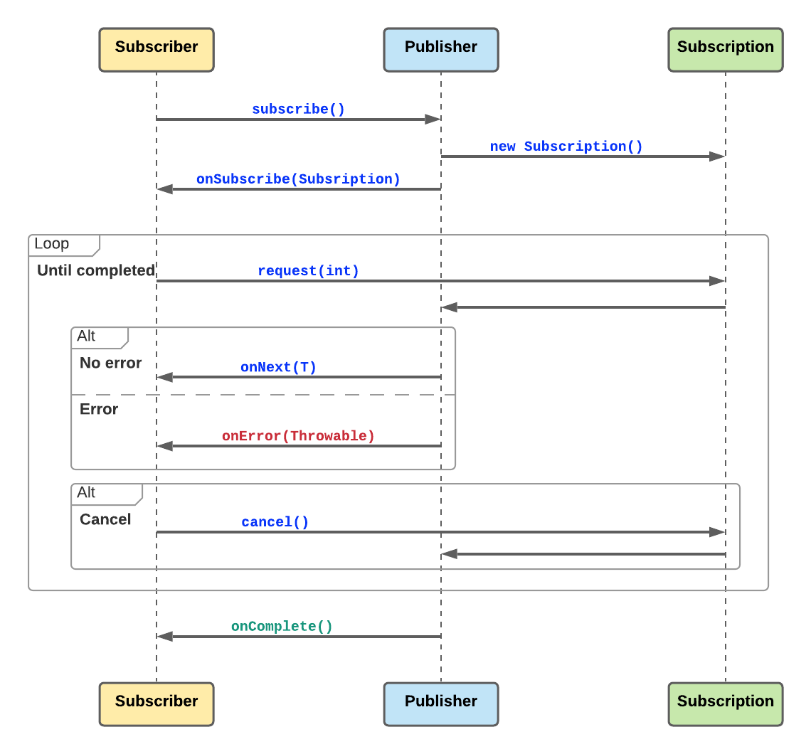

# 1. Reactive on JVM

## 1.1. Reactive Manifesto

- For an application to be reactive it has to the meet the requirements as specified in the reactive manifesto, which are -
    - Responsiveness
    - Elasticity
    - Resiliency
    - Message driven communication

[Read more](https://www.reactivemanifesto.org/)

<br/>

## 1.2. Reactive Streams API in Java 9+ -

Support for Reactive Streams has been added to the JDK, Java 9 onwards. Several interfaces have been added in the `java.util.concurrent.Flow` class. The 4 primary interfaces that define reactive streams are:
- `Publisher<T>`: A producer of items (and related control messages) received by Subscribers.
- `Subscriber<T>`: A receiver of messages.
- `Processor<T,R>`: A component that acts as both a Subscriber and Publisher.
- `Subscription`: Message control linking a Publisher and Subscriber. A Subscriber can have multiple subscriptions to a Publisher.

    ```java
    public final class Flow {
        private Flow() {}
  
        @FunctionalInterface
        public static interface Publisher<T> {
            public void subscribe(Subscriber<? super T> subscriber);
        }
  
        public static interface Subscriber<T> {
            public void onSubscribe(Subscription subscription);
            public void onNext(T item);
            public void onError(Throwable throwable);
            public void onComplete();
        }
  
        public static interface Subscription {
            public void request(long n);
            public void cancel();
        }
  
        public static interface Processor<T,R> extends Subscriber<T>, Publisher<R> {}
    }
    ```

<br/>

## 1.3. Reactive Streams Flow -



1. `Subscriber` informs `Publisher` to start streaming data by invoking the `subscribe()` method. By default streams are lazy, a `Publisher` will not start publishing data until a `Subscriber` requests.
2. On receiving the subsribe() request, Publisher creates a new `Subscription`.
3. A `Publisher` enables `Subscriber` to request events be passing the `Subscription` using the `onSubscribe()` method.
4. `Subscriber` informs `Publisher` of the initial event demand invoking the `request()` method on `Subscription`.
5. `Publisher` starts sending data in response to the request from `Subscriber`. The `onNext()` method is invoked by the `Subscriber`, until which a `Publisher` doesn't send data. If there is any error while sending data, the Publisher sends an error signal. `Subscriber` can get access to the error using the `onError()` method.
6. The `onComplete()` method is called by the `Subscriber` when a `Publisher` sends a complete signal.
7. The `Subscriber` can send a cancel signal to the `Publisher` to stop receiving data by invoking the `cancel()` method on `Subscription`.   

[Good Read on Reactive Streams Flow](https://dzone.com/articles/reactive-streams-in-java-9)

<br/>

## 1.4. Some common concepts

### 1.4.a. Streams

- The word `Observable` or `Flowable` is used to mean a reactive stream of data. Although `Observable` or `Flowable` is a type in RxJava, the other Reactive Streams libraries have other types, such as `Flux` in Reactor and `Source` in Akka Streams, that represent streams of data. Everything in Reactive Streams starts with a stream.

> Difference between `Flowable` & `Observable` is that the `Flowable` has support for backpressure, `Observable` does not.

### 1.4.b. Hot & Cold Observables

- A **hot Observable** is one that cannot be repeated. It starts creating data immediately regardless of whether it has subscribers. Typically it involves interacting with data from the outside world such as mouse inputs, data readings, or web requests.
- A **cold Observable** is one that can be repeated and does not start until subscribed to. This could be things like a range, file data, or a cached recording of data from a hot Observable.

> Hot Observables typically are candidates for using backpressure flow control strategies such as throttling, buffers, or windows.

### 1.4.c. Backpressure

- **Backpressure** is what happens when there are too many events/data in a stream than the downstream can handle. When this happens in the downstream application, it can cause big problems like OutOfMemory exceptions or starved threads and timeouts.
 
- **Backpressure strategies** help us deal with these problems proactively to avoid these problems. There are multiple backpressure strategies as discussed below -  
    - **Dropping**: We simply drop the items above what can be handled (using some criteria such as oldest or newest).
    - **Buffer**: Buffer keeps data over some time period and sticks it in a list, then observes each list. It caches all elements from a stream if too many elements were produced than the subscriber could handle. In this case the buffer is kept in memory and does not affect the data type of the stream. If buffer is used, we have the option of dropping or ignoring any elements above the buffer’s maximum size. 
    - **Window**: Window is much like buffer but results in Observables instead of lists.
    - **Latest**: Latest takes only the last element from a stream if too many elements were produced than the subscriber could handle.
    - **Throttling**: Throttle first (`throttleFirst` in RxJava) drops any elements from the stream (after the first element emitted) for some given duration. Throttle last is very similar only emitting the last element emitted during the time period instead of the first. Reactor has similar methods, `sample` and `sampleFirst`. Akka Streams has a similar method named `throttle`.
    
    
### 1.4.d. Debounce 

<br/>

## 1.5. Different Reactive Streams API Implementation

- RxJava
- Project Reactor
- Akka
    
<br/>

# 2. RxJava

> Refer to the documentation [here](http://reactivex.io/RxJava/javadoc/)    

## 2.1. Basics - `Observable` & `Observer`:

### 2.1.a. Creating an `Observable` 

- **`Observable.create()`**:  
    The `Observable.create()` factory allows us to create an Observable by providing a lambda that accepts an Observable emitter of type `ObservableOnSubscribe` that has one method `subscribe(ObservableEmitter emitter)`. `ObservableEmitter` extends `Emitter` interface which has the 3 methods - `onNext()`, `onError()` and `onComplete()`.
    
    ```java
        Observable<Integer> intSource = Observable.create(observableEmitter -> {
            for (int i = 0; i < 100; i++)
                observableEmitter.onNext(i);
            observableEmitter.onComplete();
        });
    ```
    
    - The emitter's `onNext()` method passes emissions or data down the chain of operators to the `Observer`. The `onNext()` is invoked inside the `Observer`, until then it is lazily evaluated in the `Observable`. 
    - `onComplete()` signals that there are no more items in the stream.
    - In case of any error on the stream the `onError()` method signals that there is an error in the data stream and no more data is sent henceforth. 
    - The `subscriber()` method on the `Observer` is overloaded multiple times, that accepts multiple functions for the different signals sent by the emitter.
    - The `onNext()`, `onComplete()`, and `onError()` methods of the emitter do not necessarily push the data directly to the final Observer. There can be another operator (like `map()` or `filter()`) between the source `Observable` and its `Observer` that acts as the next step in the chain.
    

### 2.1.b. Some `Observable` sources

- **`Observable.just()`**: Using `Observable.just()` we can get data from non-reactive sources. Upto 10 items can be emitted using `just()`.

    ```java
      Observable<Integer> source = Observable.just(1, 2, 3, 4, 5);
    ``` 
 
- **`Observable.fromIterable()`**: We can pass a list of items in the `fromIterable()` method to create an Observable.

    ```java
      List<String> names = List.of("Sam", "John", "Samir");
      Observable<Integer> source = Observable.fromIterable(names);
    ``` 
  
- **`Observable.range()`**: Creates an Observable that emits a consecutive range of integers, from a specified start value and increments each subsequent value by one until the specified count is reached.

    ```java
      Observable<Integer> source = Observable.range(1, 10);
    ``` 
      
- **`Observable.interval()`**: Emits infinite values from a specified start value at specified time intervals. 

    ```java
      Observable<Integer> source = Observable.interval(1, TimeUnit.SECONDS);
    ``` 
    
- **`Observable.empty()`**: Creates an Observable that emits nothing and calls `onComplete()`. 

    ```java
      Observable<Integer> source = Observable.empty();
    ``` 
  
- **`Observable.defer()`**: For Observable sources to capture changes to state we can use `Observable.defer()`, which accepts a lambda Supplier and creates an Observable for every subscription and, thus, reflects any change in its parameters.

    ```java
      int start=1, count=5;
      Observable<Integer> source = Observable.defer(() -> Observable.range(start, count));
      source.subscribe(System.out::println);
      count = 10;
      source.subscribe(System.out::println);
    ``` 
  
  In the above example, for the 2 subsriptions a new Observable is created and hence the `count` in the range is updated.
  
- **`Observable.fromCallable()`**: In order to pass an exception generated even before the creation of an Observable and we want to pass that down the Observable chain, we can use `Observable.fromCallable()`.

    ```java
      Observable.fromCallable(() -> 1 / 0)
                .subscribe(System.out::println, System.out::println);
    ``` 
  
> There are a few specialized flavors of `Observable` that are explicitly set up for one or no emissions: `Single`, `Maybe`, and `Completable`. 

[Read More](http://reactivex.io/documentation/observable.html)

### 2.1.c. `Observer` Interface

- The `Observer<T>` interface has 4 methods - `onNext()`,`onError()`, `onComplete()` and `onSubscribe()`. We already saw about the first 3 methods when we talked about `Observable.create()`. We'll look into the other method in the next section. 

### 2.1.d. Unsubscribing:

- The `onSubscribe()` method of the `Observer` interface takes in a `Disposable`.
- `dispose()` when called on a `Disposable` sends a signal from the subscriber to the producer to stop emitting data.
- When multiple subscribers are around and one of them sends a `dispose()` signal, then the producer doesn't stop sending the data.   

<br/> 

## 2.2. Basic Operators: 

### 2.2.a. Conditional
> Emit or transform `Observable` conditionally

- `takeWhile`: Takes emissions until the condition is true inside the `takeWhile()` method.
- `skipWhile`: Skips emissions based on the condition passed inside `skipWhile()` method. 
- `defaultIfEmpty`: If we want to resort to a single emission when a given `Observable` turns out to be empty, we can use `defaultIfEmpty()`.
- `switchIfEmpty`: Specifies a different `Observable` to emit values from if the source `Observable` is empty.

### 2.2.b. Suppressing
>  Operators that suppress emissions that do not meet the specified criterion. These operators work by simply not calling the `onNext()` function downstream for a disqualified emission, and therefore it does not go down the chain to Observer.
 
- `filter`: Accepts a `Predicate<T>`. If the `Predicate` returns `true` emission is passed downstream else will not allow to pass.
- `take`: Allows specified number of emissions from Observable, calls `onComplete()` and dispose of the subscription for no more emissions. 
- `skip`: Skips the specified number of emissions from upstream.
- `distinct`: Emits unique emissions and suppresses any duplicates.
- `distinctUntilChanged`: Ignores consecutive duplicate emissions. If the same value is being emitted repeatedly, all the duplicates are ignored until a new value is emitted.
- `elementAt`: We can get a specific emission by its index specified by the long value, starting at 0. After the item is found and emitted, `onComplete()` is called and the subscription is disposed of.

### 2.2.c. Transforming
> These operators transform emissions 

- `map`: For a given `Observable<T>`, the `map()` operator transforms an emitted value of the `T` type into a value of the `R` type using the `Function<T,R>` lambda expression.
- `startWithItem`: (`startWith()` in RxJava 2.x) allows us to insert a value of type `T` that will be emitted before all other values. For more than one value we can use `startWithArray()` which accepts `varargs` or `startWithIterable()` which accepts an iterable. 
- `sorted`: For a finite `Observable<T>` that emits items of primitive type, `String` type, or objects that implement `Comparable<T>`, we can use `sorted()` to sort the emissions. Internally, it collects all the emissions and then re-emits them in the specified order. 
- `scan`: Its a rolling aggregator that adds every emitted item to the provided accumulator and emits each incremental accumulated value. 

### 2.2.d. Reducing
> For a finite set of emissions we can aggregate them to a single value using reducing operators.

- `count`: The `count()` operator counts the number of emitted items and emits the result through a `Single` once `onComplete()` is called.
- `reduce`: Similar to `scan` but only emits the final result.
- Boolean operators: A sub-category of reducing operators that evaluate the result to a boolean value and return a `Single<Boolean>` object.
    - `all`: Verifies that all emissions meet the specified criterion and returns a `Single<Boolean>` object. If they all pass, it returns the `Single<Boolean>` object that contains `true`. If it encounters one value that fails the criterion, it immediately calls `onComplete()` and returns the object that contains `false`.
    - `any`: Checks whether at least one emission meets a specified criterion and returns a `Single<Boolean>`. The moment it finds an emission that does, it returns a `Single<Boolean>` object with `true` and then calls `onComplete()`. 
    - `isEmpty`: Checks whether an `Observable` is going to emit more items. It returns a `Single<Boolean>` with `true` if the `Observable` does not emit items anymore.
    - `contains`: Checks whether the specified item has been emitted by the source `Observable`.

### 2.2.e. Collection
> Collection operators accumulates all emissions into a collection such as a List or Map and then returns the entire collection as a single value.

- `toList`: For a given `Observable<T>`, it collects incoming items into a `List<T>` and then pushes that `List<T>` object as a single value through `Single<List<T>`.
- `toMap`: For a given `Observable<T>`, the `toMap()` operator collects received values into `Map<K,V>`. The key(`K`) is generated by the `Function<V,K>` function provided as the argument. 
- `collect`: We can use `collect(Callable<U> initialValueSupplier, BiConsumer<U,T> collector)` to specify a custom type for collecting items to, like `Set` or any other data structure other than `List` or `Map`.

### 2.2.f. Error Recovery
> Sometimes we want to intercept exceptions before they get to the `Observer` and attempt some form of recovery and may even pretend that the error never happened and continue processing. 

- `onErrorReturnItem` & `onErrorReturn`: When we want to resort to a default value when an exception occurs, we can use the `onErrorReturnItem()` operator. We can also use the `onErrorReturn(Function<Throwable,T> valueSupplier)` operator to dynamically produce the value using the specified function.
- `onErrorResumeWith`: (previously `onErrorResumeNext()` in RxJava2) It accepts another `Observable` as a parameter to emit potentially multiple values, not a single value, in the event of an exception.
- `retry`: This will re-subscribe the preceeding Observable to not have the error again. We can specify the number of times to retry. 

### 2.2.g. Action
> Action operators help in debugging and get a visibility into an `Observable` chain.

- `doOnNext` & `doAfterNext`
- `doOnComplete` & `doOnError`
- `doOnEach`
- `doOnSubscribe`
- `doOnDispose`
- `doOnSuccess`
- `doFinally`

### 2.2.h. Utility
> Miscellaneous operators cannot be categorized in any of the above types. 

- `delay`: Will postpone emissions by the specified time. 
- `repeat`: Will repeat subscription after `onComplete()` a specified number of times. 
- `single`: Returns a `Single` that emits the item emitted by the `Observable`. If the Observable emits more than one item, the `single()` operator throws an exception. If the Observable emits no item, it emits the default item passed to the operator as a parameter.
- `timestamp`: Attaches a timestamp to every item emitted by an `Observable`.
- `timeInterval`: Emits the time lapses between the consecutive emissions of a source `Observable`.

<br/> 

## 2.3. Combining Observables: 

### 2.3.a. `merge`

- `Observable.merge()` will take two or more `Observable<T>` sources emitting the same type `T` and then consolidate them into a single `Observable<T>`. Alternatively, we can use `mergeWith()`, which is the operator version of `Observable.merge()`.

    ```java
        Observable<Integer> src1 = Observable.just(1, 2, 3, 4, 5);
        Observable<Integer> src2 = Observable.just(15, 14, 13, 12, 11);
        Observable.merge(src1, src2)
                  .subscribe(System.out::println);
    ```
  
- It works on infinite `Observable` instances and does not necessarily guarantee that the emissions come in any order.
- If we have more than four `Observable<T>` sources, we can use `Observable.mergeArray()` to pass an array of `Observable` instances that we want to merge.

### 2.3.b `flatMap`

- `flatMap()` is used to map one emission to many emissions.
- Just like `Observable.merge()`, `flatMap()` can also map emissions to infinite instances of `Observable` and merge them. 
- The `Observable.merge()` operator accepts a fixed number of `Observable` sources. However, `flatMap()` dynamically adds new `Observable` sources for each value that comes in.
- The `flatMap()` operator has an overloaded version, `flatMap(Function<T,Observable<R>> mapper, BiFunction<T,U,R> combiner)`, that allows the provision of a combiner along with the mapper function. This second combiner function associates the originally emitted `T` value with each flat-mapped `U` value and turns both into an `R` value. 

### 2.3.b. `concat`

- 

### 2.3.c. `zip`

### 2.3.d. `group`

<br/> 

## 2.4. Concurrency & Parallelism

### 2.4.a. Threads

- Computation
- IO
- new Thread
- Single
- Trampoline
- ExecutorService

### 2.4.b. subscribeOn() vs observeOn()

<br/>

## 2.5. Backpressure

### 2.5.a. Backpressure Strategies

- Buffering
- Windowing
- Throttling
- Switching 

<br/>

# 3.Project Reactor

- Follows the reactive stream API. 
- **`Flux`** : 0,1,N elements - `Flux<T>` is the main entry point for Reactor reactive streams and is similar to RxJava’s `Observable`. 
- **`Mono`** : 0,1 elements - `Mono<T>` is like a Flux but for zero to one element.

> Both `Mono` and `Flux` implement org.reactivestreams.Publisher.

- **`Context`** : Since version 3.1.0, Reactor comes with an advanced feature that is somewhat comparable to ThreadLocal but applied to a `Flux` or a `Mono` instead of a Thread: the `Context`. Reactor’s `Context` is much like an immutable Map or key/value store. It is stored transparently from the `Subscriber` upward through the `Subscription`. `Context` is Reactor specific and does not work with the other Reactive Streams implementations.

- **`StepVerifier`** : Reactor’s `StepVerifier` can be used to verify the behavior of a Reactor Publisher (`Flux` or `Mono`). `StepVerifier` is an interface used for testing that can be created using one of several static methods on `StepVerifier` itself.

> Spring WebFlux is built on top of project reactor.

- [Project Reactor Learn](https://projectreactor.io/learn)
- [Project Reactor Documentation](https://projectreactor.io/docs/core/release/reference/)
- [Project Reactor API](https://projectreactor.io/docs/core/release/reference/)

<br/>

# 4. Akka Streams

- Akka Streams uses the concepts of `Source` and `Sink` to correspond roughly with `Publisher` and `Subscriber` of other Reactive Streams frameworks. 
- It also has the concept of `Flow` which is roughly equivalent to `Processor`.
- `Graphs` are like blueprints of `Flows`, `Sinks`, or `Sources`.
- One of the interesting things about Akka Streams is that every part can be defined, is immutable, and can be reused independently.

- **`ActorMaterializer`** : The `ActorMaterializer` in Akka Streams is similar to Schedulers in the other two Reactive Streams implementations but not the same. Unlike Schedulers, there are not several predefined singletons to choose from; instead you should generally create one for your whole application and specify some general settings.

- **`Flow`**: A `Flow` has both an input and an output. So, you can define a `Flow` with only the type of the data that will be streamed, without the actual data. It is similar to `org.reactivestreams.Processor` which is both a `Publisher` and a `Subscriber`.

- **`Graph`**: A `Graph` can define any arbitrary branching and recombining of streams. A `Graph` is immutable, thread- safe, and reusable. A `Graph` that is self-contained (has no input or output) is a `RunnableGraph` and can be materialized.

- **`Source`**: A `Source` has exactly one output. It is a source of data, similar to a `Publisher`, and can be created in many different ways.

- **`Sink`**: A `Sink` is the ending point of a stream. It represents what we do with the data. It has exactly one input.

- [Akka Streams Documentation](https://doc.akka.io/docs/akka/current/stream/index.html)

<br/>

# 5. Smallrye Mutiny

- [Smallrye Mutiny Documentation](https://smallrye.io/smallrye-mutiny/)

<br/>

    
# References
- Reactive Streams in Java by Adam L. Davis
- Learning RxJava, Second Edition by Thomas Nield

